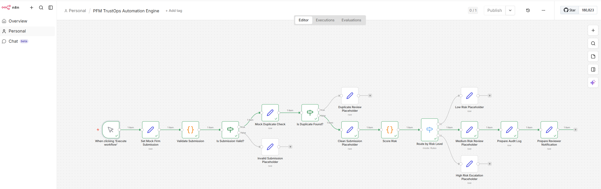

# PFM TrustOps Automation Engine

Production-minded n8n TrustOps workflow for firm submission validation, duplicate detection, deterministic risk scoring, review routing, and audit-ready operational triage.

---

<h2>Workflow Screenshot</h2>
<p align="center">
  
</p>


---
## Workflow File

The exported n8n workflow file used for this project is included in the repository:

- [trustops_workflow.json](workflow/trustops_workflow.json)

This file contains the current workflow canvas for the PFM TrustOps Automation Engine, including:
- submission validation
- valid / invalid branching
- duplicate detection routing
- deterministic risk scoring
- low / medium / high risk routing
- medium-risk audit log preparation
- reviewer notification preparation


---
## Overview

The **PFM TrustOps Automation Engine** is an n8n-based workflow designed to automate first-pass firm submission triage for a trust-focused platform environment.

The workflow takes in a firm submission, validates the payload, checks for duplicates, applies deterministic risk scoring, routes the case by risk level, and prepares downstream reviewer and audit outputs. The goal is to reduce manual operational effort while preserving trust, consistency, and auditability.

This project was intentionally designed as a **business operations automation workflow**, not just a toy automation demo. It reflects a real-world TrustOps pattern where data quality, controlled routing, and reviewer visibility matter.

---

## Business Problem

Platforms that depend on trusted firm listings and transparent reviews eventually run into operational scale problems:

- manual vetting becomes slow
- duplicate reviews create wasted effort
- inconsistent intake quality causes rework
- reviewers lack context when escalations occur
- operational decisions become harder to audit

Without a structured workflow, trust operations can become reactive, inconsistent, and difficult to scale.

This project addresses those issues through **validation-first automation**, **risk-based routing**, and **controlled reviewer handoff**.

---

## What This Workflow Does

This workflow automates the early decision-making stages of TrustOps intake:

- validates incoming firm submission data
- blocks or isolates invalid submissions
- checks whether the firm may already exist
- routes duplicates into a controlled review lane
- applies deterministic risk scoring to clean submissions
- routes cases into low, medium, or high-risk paths
- prepares audit-ready decision context
- prepares reviewer-facing notification context

---

## Architecture Breakdown

### Workflow Flow

`When clicking 'Execute workflow' → Set Mock Firm Submission → Validate Submission → Is Submission Valid? → Mock Duplicate Check → Is Duplicate Found? → Clean Submission Placeholder → Score Risk → Route by Risk Level → Low / Medium / High Risk Placeholder`

### Current visible branch structure

The workflow currently includes these control and routing stages:

1. **When clicking 'Execute workflow'**  
   Manual execution trigger used to run the workflow in a controlled testing/demo environment.

2. **Set Mock Firm Submission**  
   Creates the input payload used for downstream validation and decisioning.

3. **Validate Submission**  
   Applies input and schema validation logic to ensure the submission is usable.

4. **Is Submission Valid?**  
   Branches valid vs invalid submissions.

5. **Invalid Submission Placeholder**  
   Represents the isolated handling lane for malformed or incomplete submissions.

6. **Mock Duplicate Check**  
   Applies duplicate detection logic against firm identity signals.

7. **Is Duplicate Found?**  
   Branches duplicate vs clean submissions.

8. **Duplicate Review Placeholder**  
   Represents the controlled review path for firms that may already exist.

9. **Clean Submission Placeholder**  
   Represents a submission that passed validation and duplicate screening.

10. **Score Risk**  
    Applies deterministic risk scoring based on business and trust signals.

11. **Route by Risk Level**  
    Routes the submission into low-risk, medium-risk, or high-risk treatment paths.

12. **Low Risk Placeholder**  
    Represents a lighter downstream handling path.

13. **Medium Risk Review Placeholder**  
    Represents an analyst review lane.

14. **High Risk Escalation Placeholder**  
    Represents an escalation path for the riskiest cases.

15. **Prepare Audit Log**  
    Builds structured audit context for decisions made in the visible review path.

16. **Prepare Reviewer Notification**  
    Builds the reviewer-facing summary/output for downstream action.

> In the current visible build, **Prepare Audit Log** and **Prepare Reviewer Notification** are attached to the **medium-risk review path** shown in the workflow canvas.

---

## Security and Control Design

The security control design is embedded directly into the workflow’s trust decision points.

### 1. Input Control
**Nodes involved:**
- Set Mock Firm Submission
- Validate Submission
- Is Submission Valid?

**Purpose:**  
Treat all incoming submission data as untrusted until it passes validation.

**Why it matters:**  
Bad input should not move deeper into the workflow. This prevents malformed data, incomplete payloads, and poor-quality records from creating downstream instability or wasted analyst effort.

---

### 2. Integrity Control
**Nodes involved:**
- Mock Duplicate Check
- Is Duplicate Found?

**Purpose:**  
Preserve record integrity and reduce duplicate handling.

**Why it matters:**  
Duplicate submissions create operational waste, fragmented records, and inconsistent trust decisions. This control helps ensure firms are not repeatedly or blindly processed.

---

### 3. Risk Control
**Nodes involved:**
- Score Risk
- Route by Risk Level

**Purpose:**  
Apply deterministic rules to determine how much attention, scrutiny, or escalation a submission deserves.

**Why it matters:**  
Not every submission should be treated the same. Risk-based routing improves prioritization, consistency, and reviewer efficiency.

---

### 4. Governance Control
**Nodes involved:**
- Low Risk Placeholder
- Medium Risk Review Placeholder
- High Risk Escalation Placeholder

**Purpose:**  
Enforce different downstream treatment based on risk.

**Why it matters:**  
This is where the workflow becomes production-minded. Lower-risk items can move more efficiently, while medium- and high-risk items can receive human review or escalation.

---

### 5. Audit Control
**Nodes involved:**
- Prepare Audit Log
- Prepare Reviewer Notification

**Purpose:**  
Generate decision evidence and reviewer context.

**Why it matters:**  
A workflow should not just make decisions. It should preserve why the decision was made, what path was taken, and what the next reviewer needs to know.

---

## Why This Project Matters

This project demonstrates that workflow automation can be built with the mindset of:

- **operational scale**
- **controlled decisioning**
- **human-in-the-loop review**
- **clear auditability**
- **trust-preserving automation**

It is not just about moving data through nodes. It is about deciding:

- is the data usable?
- is this already known?
- how risky is it?
- who should handle it next?
- what evidence should be retained?

That is what makes this a strong TrustOps and AI automation portfolio project.

---

## Business Value

This workflow is designed to improve operations by:

- reducing time spent on invalid submissions
- reducing duplicate review effort
- improving consistency in first-pass triage
- helping reviewers focus on higher-risk cases
- improving auditability of operational decisions
- creating a more scalable intake and review process

### Pain points solved

- slow manual vetting
- duplicate analysis
- inconsistent triage logic
- poor reviewer handoff context
- limited visibility into decisions and escalations

---

## Current Build Status

### Completed
- mock submission intake
- validation logic
- valid / invalid branching
- duplicate check branching
- clean submission routing
- deterministic risk scoring
- low / medium / high risk routing
- medium-risk audit log preparation
- medium-risk reviewer notification preparation

### Currently represented as placeholders
- valid submission placeholder
- invalid submission handling lane
- duplicate review lane
- clean submission output lane
- low-risk downstream handling
- medium-risk expanded analyst workflow
- high-risk escalation workflow

This modular placeholder structure is intentional and makes it easier to evolve each branch into a production-grade subflow later.

---

## Example Production Expansion

Future production versions of this workflow could add:

- live database-backed duplicate detection
- Airtable / Postgres / Google Sheets integration
- Slack or email notifications
- reviewer approval workflows
- durable audit log storage
- retry and failure queue handling
- dashboard metrics for review volumes and routing
- fuzzy matching for duplicate firm detection
- role-based access and escalation controls

---

## Suggested Metrics

A stronger production version of this workflow could track:

- submission validation failure rate
- duplicate detection rate
- percentage of auto-triaged submissions
- review turnaround time
- high-risk escalation count
- audit log generation success rate
- workflow failure / retry counts

---

## Repo Structure

```text
PFM-TrustOps-Automation-Engine/
│
├── README.md
├── docs/
│   ├── TrustOps_Automation_Project_Study_Guide_v2.docx
│   ├── PFM_TrustOps_Playbook_Updated.docx
│
├── images/
│   ├── workflow-diagram.png
│   ├── architecture-overview.png
│   ├── risk-routing-view.png
│
├── workflow/
│   └── trustops_workflow.json
│
└── notes/
    └── project-summary.md
